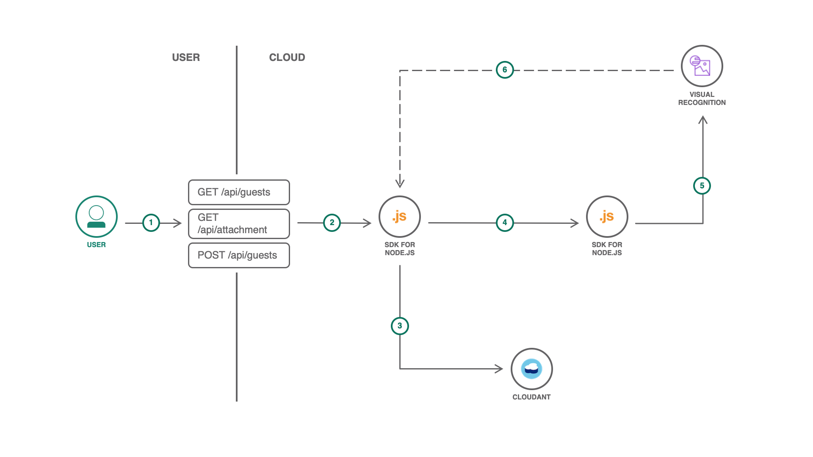

# Node.js IBM CloudFoundry Demo

## Description

This project is a demonstration for Node.js Microservices and Container-to-Container networking on IBM Cloud Foundry. It involves two distrinct microservices in combination with a Cloudant NoSQL database and the Watson Visual Recognition API which provide a simple 'Guestbook' functionality to the user. In order to demonstrate the concept of Container-to-Container networking, the second microservice which connects to the Watson API is not required for the basic functionality of the application (add a guest, show all guests) and can be added sperately afterwards. This helps to show that both microservices/CF applications communicate with each other and that the second service only needs an internal route due to the configurated networking policy.

## Architecture



1. The frontend/interface for the user is served by the 'main-service' (left Node.js application)
2. Backend API calls to create a new guestbook entry and to retrieve entries and images
3. Save/Retrieve entries in/from the connected Cloudant database
4. API Request from 'main-service' to 'watson-service' to analyse the previously saved image
5. Use Waston Visual Recognition API to analyse the image using the provided image URL and create tags from this data
6. Retrieve the image stream from the Cloudant Blob store by using the previously (in step 3) created URL

## Contents

This repository includes both microservices/Node.js applications, the 'main-service' and the 'watson-service' which are saved in the same called sub-directories. Hereby, the 'main-service' is responsible for the basic functionality of the guestbook (HTML, create, list, database connection) while the 'watson-service' is optional and handles the connection with the Watson Visual Recognition API and their results. Both applications are full Node.js REST APIs and their root folders include a README.md file with more information about their functionality.

## Deployment

### Prerequisites

- Install latest version of IBM Cloud CLI: https://cloud.ibm.com/docs/cli?topic=cloud-cli-getting-started
- If not present, create Account on IBM Cloud: https://cloud.ibm.com/registration
- Login into your Cloud Foundry organization and space: https://cloud.ibm.com/docs/cli?topic=cloud-cli-getting-started#step3-configure-idt-env
- Latest version of GitHub: https://git-scm.com/downloads
- Latest version of Node.js for running the server locally: https://nodejs.org/en/download/
- code editior/IDE of your choice (VS CODE, Atom, Sublime...)

### Local setup

- open a terminal at the location of your choice
- clone Github Project using `git clone https://github.com/m-lukas/cf-nodejs-c2c-demo.git`
- use command `cd cf-nodejs-c2c-demo` to access the project folder
- open the project in the code editior/IDE of your choice

### Main-Service

- open your prefered browser
- go to the compute section in the IBM Cloud catalog https://cloud.ibm.com/catalog?search=label:lite&category=compute (scroll down) > Section: CloudFoundry > click on SDK for Node.js™ = Create a CloudFoundry App
- Enter app name - for this example "guestbook-main"
- Hostname fills out automatically and can stay like this
- choose Domain, Region/Location, Organisation and Space ... for Lite-Edition can stay on defaults: Domain: eu-gb.bluemix.net, Region: London, default org and space
- Tags: add "guestbook" -> helps you to find your resources better
- Choose: Pricing Plan ... Lite is enough -> select Memory: 64MB or 128MB
- Click on "Create" (blue button, right bottom corner)
- => CloudFoundry App has been created
- (Redirect to the Getting Started page of the Application)
- Wait until the app is started (status next to the application name)
- App can be checked by clicking on Routes (top-right corner) and selecting the first route/url in there which ends on .mybluemix.net - afterwards go back to IBM Cloud
- go again to the catalog but this time to the "Databases" category https://cloud.ibm.com/catalog?search=label:lite&category=databases, click on the product card "Cloudant"
- type in a service name, for this example: guestbook
- choose a region/location
- add tag: "cloudant-database"
- select the authentification method: "Use both legacy credentials and IAM" to log into Cloudant using HTTP basic auth
- choose your prefered pricing plan ... Lite plan is completely sufficent
- in the resource list, under "Cloud Foundry Apps", click on the name of your previously created "guestbook-main" application -> alternatively you can also search for the name or filter for the "guestbook" tag in the table
- in the side-bar, click on the item "Connections"
- click on the button "Create connection"
- in the appearing table, hover over your cloudant database "guestbook-database" and click "Connect" to configurate a connection between the main-service and the database
- in the popup "Connect IAM-Enabled Service", select "Manager" as "Access Role for Connection" and "Auto Generate" as "Service ID for Connection", click on "Connect" to submit these settings
- restage the app afterwards (click on "Restage in popup")

#### Local Deployment ()

- after the app is restaged, "guestbook-database" appears in the list as connection -> click the 3 horizontal dots in it
- in the menu, click on "View credentials" and copy the displayed (json) code from the box within the popup (CTRL/CMD+C or using the button)
- go to you code editor and open the folder "main-service"
- rename the file "vcap-local.json.example" to "vcap-local.json" and paste the credentials code behind `"services":`
example:
```
{
  "services": {
    "cloudantNoSQLDB": [
    {
      ...
    }
  ]
}
}
```
- => application is ready to be tested
- in your terminal, use the command `cd main-service` to access the main application folder
- use the command: `npm install` to install all dependencies
- start the server with `npm run dev`
- => expected output:
```
    ...
    Loaded local VCAP { services: { cloudantNoSQLDB: [ [Object] ] } }
    Successfully initialized cloudant client!
    [ENV] Server Port: 
    [ENV] Image Base Path: 
    [ENV] Watson Microservice: 
    Listening on port: 5000
```
- Guestbook is available under: http://localhost:5000/
- => Listing and adding of new guests should already work
- (on adding a new entry, it will show an error message in the terminal due to the missing second application. This error message can be ignored)

#### CloudFoundry Deployment

- in your terminal, use the command `cd main-service` to access the main application folder
- in your terminal, navigate to the main application folder using the command `cd main-service` if you are in the root project folder or stay in the same folder if you did the local deployment before
- log into the ibmcloud CLI using: `ibmcloud login -sso`
- (if the region in the table doesn't accord you previously selected region for the application, use the same command with an additional flag: `ibmcloud login -sso -r <region>`)
- following use the command `ibmcloud target --cf` to target your CloudFoundry Org and Space
- (IF you did NOT use 'guestbook-main' as name for the application, please remember changing the name in the `manifest.yml` file)
- use `ibmcloud cf push` to push the application the the cloud
- if it was successful, it should give a output similar to this:
```
Waiting for app to start...

name:              guestbook-main
requested state:   started
routes:            <route>
last uploaded:     Fri 19 Jul 11:12:44 CEST 2019
stack:             cflinuxfs3
buildpacks:        SDK for Node.js(TM) (ibm-node.js-6.17.1, buildpack-v3.27-20190530-0937)

type:            web
instances:       1/1
memory usage:    128M
start command:   ./vendor/initial_startup.rb
     state     since                  cpu    memory          disk          details
#0   running   2019-07-19T09:13:01Z   0.5%   28.7M of 128M   63.5M of 1G
```
- from the list, you can copy the route and open it in your browser to see the Guestbook application

### Watson-Service

- in your browser, open the link: https://cloud.ibm.com/catalog?search=label:lite&category=compute to get to the Compute category in the IBM Cloud catalog
- go to the Cloud Foundry section and create a "SDK for Node.js™" application by clicking on the card
- this time, use "guestbook-watson" as App name, use the default domain ending on ".mybluemix.net", set your prefered region/location (for Lite: eu-gb), add tag: "guestbook" and select you pricing plan and memory: Free and 64MB is enough
- Click on "Create" (blue button, right bottom corner)
- => CloudFoundry App has been created
- (Redirect to the Getting Started page of the Application)
- Wait until the app is started (status next to the application name)
- App can be checked by clicking on Routes (top-right corner) and selecting the first route/url in there which ends on .mybluemix.net - afterwards go back to IBM Cloud
- go again to the catalog but this time to the "AI" category https://cloud.ibm.com/catalog?search=label:lite&category=ai, click on the product card "Visual Recognition"
- type in the Service name: "guestbook-visual", set the tag "guestbook", and select the pricing plan: "Lite" should be enough
- subsequently click on "Create"
- (redirect to the "Getting Started" page of the visial regocognition service)
- in the side-bar, click on the item "Connections"
- click on the button: "Create connection"
- in the filter of the table, select the region/location of your previously created "guestbook-watson" Cloud Foundry application
- in the table, hover over the "guestbook-watson" item and click on "Connect"
- Access Role fo Connection: "Manager", Service ID for Connection: empty, other fields: empty
- Click on "Connect & restage app" to create the connection configuration
- agree the restaging of the app with a click on "Restage"
- after the app is restarted, click on the "guestbook-watson" application in the table to go to the application dashboard

#### Local Deployment

(step is only possible with local deployment of main-service)

- in the sidebar- click on the item "Connections"
- in the table you will the the "guestbook-visual" service, as binded connection
- subsequently, click on the 3 horizontal dots (menu) in the table row and click on "View credentials" and copy the credentials JSON
- in your code-editor go into the directory "watson-service" and open the file "vcap-local.json.example"
- behind "services": paste the credentials JSON
- example:
```
{
  "services": {
    "{"watson_vision_combined": [
    {
      ...
    }
  ]
}
}
```
- switch to a new terminal tab, go into the folder, run `npm install` and following: `npm run dev`
- this will start your local application
- => in the web app (localhost) - the appluication should be run completely (tags)

(WATSON SERVICE NEEDS CLOUDANT URL!)

#### CloudFoundry Deployment

### Container-to-Container Networking

## License
Apache 2.0. See [LICENSE.txt](LICENSE.txt)

> Licensed under the Apache License, Version 2.0 (the "License");
> you may not use this file except in compliance with the License.
> You may obtain a copy of the License at
>
> http://www.apache.org/licenses/LICENSE-2.0
>
> Unless required by applicable law or agreed to in writing, software
> distributed under the License is distributed on an "AS IS" BASIS,
> WITHOUT WARRANTIES OR CONDITIONS OF ANY KIND, either express or implied.
> See the License for the specific language governing permissions and
> limitations under the License.
