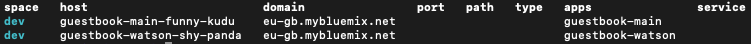

# Container-to-Container Networking IBM CF Demo

## Description

This project is a demonstration of Node.js Microservices and Container-to-Container networking on IBM Cloud Foundry. It involves two distinct microservices in combination with a Cloudant NoSQL database and the Watson Visual Recognition API which provide a simple 'Guestbook' functionality to the user. To demonstrate the concept of Container-to-Container networking, the second microservice which connects to the Watson API is not required for the basic functionality of the application (add a guest, show all guests) and can be added separately afterwards. This helps to show that both microservices/CF applications communicate directly with each other and that the second service only needs an internal route due to the configurated networking policy.

## Table of Contents

- [Architecture](#architecture)
- [Repository](#repository)
- [Deployment](#deployment)
  - [Prerequisites](#prerequisites)
  - [Local Setup](#local-setup)
  - [Guestbook-Main](#guestbook-main)
  - [Guestbook-Watson](#guestbook-watson)
  - [Connecting Both Applications](#connecting-both-applications)
  - [Container-to-Container Networking](#container-to-container-networking)
  - [Local Testing (optional)](#local-testing-optional)
    - [Deploying Guestbook-Main locally](#deploying-guestbook-main-locally)
    - [Deploying Guestbook-Watson locally](#deploying-guestbook-watson-locally)
- [License](#license)
 
## Architecture


1. The frontend/interface for the user is served by the `guestbook-main` application (left Node.js application)
2. Backend API calls for creating a new guestbook entry, retrieving of entries and retrieving of images
3. Save/Retrieve entries in/from the connected Cloudant database
4. API Request from `guestbook-main` to `guestbook-watson` to analyse the previously saved image
5. Use Waston Visual Recognition API to analyse the image using the provided image URL and create tags from this data
6. Retrieve the image stream from the Cloudant Blob store by using the previously (in step 3) created URL

## Repository

This repository includes both microservices/Node.js applications, `guestbook-main` and `guestbook-watson` which are saved in the same called sub-directories. Hereby, `guestbook-main` is responsible for the basic functionality of the guestbook (HTML, create, list, database connection) while `guestbook-watson` is optional and handles the connection with the Watson Visual Recognition API and their results. Both applications are full Node.js REST APIs and their root folders include a README file with more information about their functionality.

- [Detailed Information about Guestbook-Main and Troubleshooting](guestbook-main/README.md)
- [Detailed Information about Guestbook-Watson](guestbook-watson/README.md)

## Deployment

### Prerequisites

- Install the latest version of the IBM Cloud CLI: [IBM Cloud CLI Tutorial](https://cloud.ibm.com/docs/cli?topic=cloud-cli-getting-started)
- If not present, create Account on IBM Cloud: [IBM Cloud Registration](https://cloud.ibm.com/registration)
- Create an organization and space for Cloud Foundry: [CF Org and Space Creation Manual](https://cloud.ibm.com/docs/account?topic=account-orgsspacesusers)
- Log into your Cloud Foundry organization and space: [CF Org and Space Configuration Tutorial](https://cloud.ibm.com/docs/cli?topic=cloud-cli-getting-started#step3-configure-idt-env)
- Install the latest version of Git: [Git Download Page](https://git-scm.com/downloads)
- Install the latest version of Node.js for running the server locally: [Node.js Download Page](https://nodejs.org/en/download/)
- You need a code editor/IDE of your choice (VS CODE, Atom, Sublime...) to make motifications to the app

### Local Setup

1. First, open a terminal in a directory of your choice on your local computer.
2. Clone this Git repository by using the command: `git clone https://github.com/m-lukas/cf-nodejs-c2c-demo.git`.
3. Following, use the command `cd cf-nodejs-c2c-demo` to navigate into the project folder.
4. Furthermore, open the project in the code-editor/IDE of your choice.

### Guestbook-Main

1. Go to the IBM Cloud "Catalog" by clicking on the same-named navigation item on the IBM CLoud Dashboard or by opening the following link: [https://cloud.ibm.com/catalog](https://cloud.ibm.com/catalog)
2. Search for the product "Cloudant" in the search bar or go to the "Databases" section directly.
3. Click on the product card "Cloudant" to provision a new Cloudant NoSQL database.
4. Fill out the form for the database creation:

- **Region/Location** - To reduce latency, use the same region/location as of your CF space.
- **Pricing Plans** - Select your prefered pricing plan and memory. The Lite plan is sufficient for our needs.
- **Service name** - To keep it simple, we will use the name `guestbook-database` for this service.
- **Tags** - Add the tag `guestbook` to find your resources more easily.
- **Authentication Methods** - Select the authentification method: `Use both legacy credentials and IAM` to enable HTTP authentification which is needed to send the requests to the database.

5. Click on the button "Create" to submit the form and create the database.

- You're redirected to the resource list. The provisioning might take up to 5 minutes. In the meantime, we are going to deploy the `guestbook-main` application.

6. Open your local terminal and navigate into the folder "guestbook-main" by using the command: `cd <Path to folder>`
7. Push the application to IBM Cloud using the CLI (installation see Prerequisites):

---
*** Cloud Foundry Login (can be skiped if you are already logged in with the CLI)

- Use the command `ibmcloud login -sso` to log into your IBM Cloud account using Single-Sign-On.
- **IF** the region in the output table does **NOT** accord your previously selected region/location for the "guestbook-main" application, use the command `ibmcloud login -sso -r <region>` to change it (for example: `ibmcloud login -sso -r eu-gb`) for London.
- Afterwards, target your CF organization and space using `ibmcloud target --cf`. This will complete your local configuration for pushing to Cloud Foundry.
---

- With the command `ibmcloud cf push` you can push (upload and deploy) your application to IBM Cloud Foundry now.
- After a successful push, you will see an output similar to this:

```shell
Waiting for app to start...

name:              guestbook-main
requested state:   started
routes:            <ROUTE>
last uploaded:     Fri 19 Jul 11:12:44 CEST 2019
stack:             cflinuxfs3
buildpacks:        SDK for Node.js(TM) (ibm-node.js-6.17.1, buildpack-v3.27-20190530-0937)

type:            web
instances:       1/1
memory usage:    128M
start command:   ./vendor/initial_startup.rb
     state     since                  cpu    memory          disk          details
#0   running   2019-07-19T09:13:01Z   0.5%   28.7M of 128M   63.5M of 1G
```

- You can copy the `<ROUTE>` value from the output now and open it in the browser to see the deployed Guestbook. Please notice that the application has no functionality yet because neither the database nor the seond service are connected.

8. Go back to the IBM Cloud Resource Overview ([https://cloud.ibm.com/resources](https://cloud.ibm.com/resources))
9. Make sure the status of `guestbook-database` in the "Services" section is `Provisioned`. You might have to reload the page.
10. Click on the "guestbook-database" name to go to the service dashboard.
11. In the sidebar of the service dashboard, click on the item "Connections".
12. Subsequently, on the connections page, click the button "Create connection" to create a new connection configuration between the application and the service.
13. After selecting the region/location of the previously created application (regeion you logged in with, displayed on `ibmcloud target`) in the filter of the table, you will see the application `guestbook-main` as an entry in the table.
14. Hover over the `guestbook-main` row to find the "Create" button and click on it.
15. In the form for creating the connection, you can stay with the default values. The "Access Role" should be `Manager`. Following, click on the "Connect & restage app" button.
16. You might have to confirm the restaging of the `guestbook-main` application in another popup.
17. In the table, under "Connected Applications", you will find `guestbook-main` as an entry. 
18. Click on the `guestbook-main` row to go to the application dashboard.

- After the application is restaged/restarted, you can visit the App URL/Route again and create your first Guestbook entry. The tags are added after connecting the second application.

### Guestbook-Watson

1. In your browser, go again to the IBM Cloud dashboard ([https://cloud.ibm.com/](https://cloud.ibm.com/)).
2. Similar to the procedure for the first application, go to the IBM Cloud catalog by clicking on the navigation item "Catalog".
3. Following, either search for "Visual Recognition" or navigate directly to the "AI" section.
4. Click on the card "Visual Recognition" in the AI section to create new API credentials for the IBM Watson API.
5. Fill out the form for the service creation:

- **Pricing Plans** - Select your prefered pricing plan and memory. The Lite plan is sufficient for our needs.
- **Service name** - To keep it simple, we will use the name `guestbook-visual` for this service.
- **Tags** - Add the tag `guestbook` to find your resources more easily.

6. Click on the button "Create" to submit the form and create the database.

- You're redirected to the service dashboard. But because `guestbook-watson` is not deployed yet, we can't create a connection yet. This is what we are going to do in the next steps.

7. Back in your terminal, navigate into the folder "watson-app" by using the command: `cd <Path to folder>`

> (if you're still inside of the "guestbook-main folder, this can be archieved by using `cd ../guestbook-watson`)

8. Push the application to IBM Cloud using the CLI (installation see Prerequisites):

---
*** Cloud Foundry Login (can be skipped if you are already logged in with the CLI)

- Use the command `ibmcloud login -sso` to log into your IBM Cloud account using Single-Sign-On.
- **IF** the region in the output table does **NOT** accord your previously selected region/location for the "guestbook-watson" application, use the command `ibmcloud login -sso -r <region>` to change it (for example: `ibmcloud login -sso -r eu-gb`) for London.
- Afterwards, target your CF organization and space using `ibmcloud target --cf`. This will complete your local configuration for pushing to Cloud Foundry.
---

- With the command `ibmcloud cf push` you can push (upload and deploy) your application to IBM Cloud Foundry now.
- After a successful push, you will see an output table similar to the one of the `guestbook-main` deployment.

9. Copy the `<ROUTE>` value of `guestbook-watson` from the terminal output which should contain this section:
```shell
    name:              guestbook-watson
    requested state:   started
    routes:            <ROUTE>
```

- You might also want to test this route/URL in your browser but you will get a `Cannot GET /` http error due to the API route structure. Try to use `http://<ROUTE>/api` instead.

10. Go back to the service dashboard of `guestbook-visual` in your browser. If you closed the site before, you can navigate there by using the resource list: [https://cloud.ibm.com/resources](https://cloud.ibm.com/resources)
9. In the sidebar, click on the item "Connections".
10. Subsequently, on the connections page, click the button "Create connection" to create a new connection configuration between the application and the service.
11. After selecting the region/location of the previously created application in the filter of the table, you will see the application `guestbook-watson` as an entry in the table.
12. Hover over the `guestbook-watson` row to find the "Create" button and click on it.
13. In the form for creating the connection, you can stay with the default values. The "Access Role" should be `Manager`. Following, click on the "Connect & restage app" button.
14. You have to confirm the restaging of the `guestbook-watson` application in another popup.
15. In the table, under "Connected Applications", you will find `guestbook-watson` as an entry. 16. Click on the `guestbook-watson` row to go to the application dashboard.

### Connecting both Applications

The connection between both applications is established via environmental variables. Therefore, we can use the CLI again.

1. In your local terminal use the following two commands to set the regarding environmental variables:

- `ibmcloud cf set-env guestbook-main WATSON_IMAGE_URL <URL of guestbook-main>`
- `ibmcloud cf set-env guestbook-main WATSON_SERVICE_URL <URL of guestbook-watson>`

- Following use the command `ibmcloud cf restage guestbook-main` to apply the changes.
2. After restaging `guestbook-main` you can visit the app URL in the browser and try out the fully functional Guestbook 🎉.

Short explination:

- **Variable:** `WATSON_IMAGE_URL`, **Value:** is the public URL/route of `guestbook-main`. Because the images from Cloudant are piped via `guestbook-main`, this URL is used for creating the public Image-URL which is used by Watson. It can be retrieved by visiting the App URL of `guestbook-main` (e.g. navigating to the application dashboard and clicking on "Visit App URL" or by using the route from the deployment output).
- **Variable:** `WATSON_SERVICE_URL`, **Value:** is the local or public URL/route of `guestbook-watson`. It is used by `guestbook-main` to send the requests to the watson-app. It can be retrieved by navigating to the dashboard of "guestbook-watson" (e.g. [http://cloud.ibm.com/resources?groups=cf-application](http://cloud.ibm.com/resources?groups=cf-application) and clicking the application name), followed by a click on "Visit App URL".

- **Please make sure to use URLs in the format `https://<...>/`. Invalid or wrong URLs will cause errors in the communication between guestbook-main and guestbook-watson! (proper formatting example: https://guestbook-main-xyz.eu-gb.mybluemix.net/)**

### Container-to-Container Networking

This step can only be done after `guestbook-main` and `guestbook-watson` are running publicly on IBM Cloud Foundry.

1. In your local terminal, use the command `ibmcloud cf routes` to display all routes in your CF space.

2. Delete the existing public route of `guestbook-watson` by using the command: `ibmcloud cf delete-route <domain> --hostname <host>`. (Confirm with "`y`")

- **Example** based on the image above: `ibmcloud cf delete-route eu-gb.mybluemix.net --hostname guestbook-watson-shy-panda`

3. After deleting the public route, we will create a private route using: `ibmcloud cf map-route guestbook-watson apps.internal --hostname <host>`

- It is recommended to use the same hostname for the private route as of the public route to avoid confusion.
- **Example** based on the image above: `ibmcloud cf map-route guestbook-watson apps.internal --hostname guestbook-main-funny-kudu`

4. Following, you can use `ibmcloud cf routes` again to verify the changes.
5. Copy the new private route (ending on `apps.internal`) from the output of step 3 or 4.
6. Now, we will update the connection to `guestbook-main`: Use the command `ibmcloud cf set-env guestbook-main WATSON_SERVICE_URL <http:// + private route of guestbook-watson + :8080>` to update the environmental variable. We need to add the HTTP protocol and additionally, we need to add the port `:8080` to make the internal connection working.

- **Example** for the URL: `http://guestbook-main-funny-kudu.eu-gb.mybluemix.net:8080` (Please notice the **http://** instead of **https://**!)

7. After updating the environmental variable, we need to restage `guestbook-main` again by using `ibmcloud cf restage guestbook-main`.

> You can test the application now again but you will notice that the tag analysis on adding a guestbook entry won't work. The reason therefor is that we didn't add a policy for the communication between `guestbook-main` and `guestbook-watson` yet. By removing the public route, `guestbook-watson` only accepts internal traffic from apps which have to be configurated first.

8. In your terminal, use the following command to establish a new network policy:
`ibmcloud cf add-network-policy guestbook-main --destination-app guestbook-watson --protocol tcp --port 8080`
- In case it ran successfully, this command should return the response "OK".

> Now, you can test the application again. The policy enables `guestbook-main` to communicate with `guestbook-watson` internally via container-to-container networking, without exposing `guestbook-watson" publicly`.

**You have successfully completed the tutorial now! 🎉 If you consider modifying the applications, you can go on with the "Local Testing" section**

## Local Testing (optional)

Local Testing is only necessary if you consider modifying the application code. In this case, you can very quickly restart the application to debug it more easily. 

### Deploying Guestbook-Main locally

In opposite to the second application of our example, `guestbook-main` does not require the second application to work. If the second application `guestbook-watson` is not available, it won't analyse the image to retrieve the tags but the remaining functionality of the Guestbook does not depend on it. Please notice that the terminal will display an HTTP error (status 404) in the case that the second application is missing which can be ignored.

1. Back in your browser, go to the application dashboard of `guestbook-main`. (for example by navigation to the resource list [https://cloud.ibm.com/resources](https://cloud.ibm.com/resources) and clicking on the application name.
2. On the application dashboard of the `guestbook-main`, click on "Connections" in the sidebar.
3. In the table, you will see the connection to the database `guestbook-database` as an entry. In its row, click on the 3 horizontal dots to open the menu.
4. In the menu, click on "View credentials" to open a popup with the credentials for this connection.
5. Copy the displayed code block either by clicking on the small copy icon or by selecting the code and copying it by using CTLR/CMD + C.
6. Open the previously cloned "cf-nodesjs-c2c-demo" project in the code editor of your choice and expand the sub-directory "guestbook-main"
7. In it, you will find a file called `vcap-local.json.example`. Rename this file to `vcap-local.json` and paste the copied code behind `"services:"`.

- `vcap-local.json` is the local configuration for the connection to the database. It is automatically parsed on the start of the server and contains all connection information and credentials.
- After pasting, the file should look similar to this example:

```javascript
{
  "services": {
    "cloudantNoSQLDB": [
    {
      <connection information and credentials>
    }
  ]
}
}
```

- Afterwards, the application is ready to be tested. 🎉

8. In your terminal, navigate into the folder "guestbook-main" by using the command: `cd <Path to folder>`
9. Use the command: `npm install` to install all dependencies of the application locally. If Node.js is not installed, install the latest version on your machine (see Prerequisites).
10. Following, start the server using: `npm run dev`. This opens the server using the watcher `nodemon` which reloads the server on every file change.

- The expected output of this command looks something to this:

```shell
    ...
    Loaded local VCAP { services: { cloudantNoSQLDB: [ [Object] ] } }
    Successfully initialized cloudant client!
    [ENV] Server Port: 5000
    [ENV] Image Base Path: 
    [ENV] Watson Microservice: http://localhost:3000
    Listening on port: 5000, Link: http://localhost:5000
```

- The app should be reachable in your local browser by using the URL: [http://localhost:5000/](http://localhost:5000/)

### Deploying Guestbook-Watson locally

Testing the second application is more complicated than testing the first one. The Watson API requires a public URL of the image which is going to be analysed. While Cloudant lets you save files in an integrated Blob-store as well, it does require authentification for accessing the uploaded files via public URLs. That's why `guestbook-main` provides a public URL and pipes the file-stream from Cloudant instead. However, this requires a deployed version of `guestbook-main` and some configuration which is described in this section.

1. Make sure the `guestbook-main` is deployed to Cloud Foundry and started (`ibmcloud cf apps`)
2. Open the application dashboard of `guestbook-watson` (for example by navigating to [https://cloud.ibm.com/resources?groups=cf-application](https://cloud.ibm.com/resources?groups=cf-application) and clicking on your application name).
3. On the application dashboard of the `guestbook-watson`, click on "Connections" in the sidebar.
4. In the table, you will see the connection to the watson-service `guestbook-visual` as an entry. In its row, click on the 3 horizontal dots to open the menu.
5. In the menu, click on "View credentials" to open a popup with the credentials for this connection.
6. Copy the displayed code block either by clicking on the small copy icon or by selecting the code and copying it by using CTLR/CMD + C.
7. Now, open the subdirectory "guestbook-watson" in your local code-editor.
8. In it, you will find a file called `vcap-local.json.example` as well (the same procedure as for main-app). Rename this file to `vcap-local.json` and paste the credentials code behind `"services:"`.

- After pasting, the file should look similar to this example:

```javascript
{
    "services": {
      "watson_vision_combined":[
        {
          <connection information and credentials>
        }
      ]
    }
}
```

9. In your terminal, navigate into the folder "guestbook-watson" by using the command: `cd <Path to folder>`.
10. Use the command: `npm install` to install all dependencies of the application locally. If Node.js is not installed, install the latest version on your machine (see Prerequisites).
11. Following, start the server using: `npm run dev`. This opens the server using the package nodemon which reloads the server on every file change.

- Expected output:
```shell
  Loaded local VCAP { services: { watson_vision_combined: [ [Object] ] } }
  Successfully initialized watson client!
  [ENV] Server Port: 3000
  Listening on port: 3000, Link: http://localhost:3000
```
- Guestbook-Watson is running locally now 🎉
- If you only want to test the functionality of "watson-app", you can simply send HTTP-requests (for example by using curl or Postman) to `http://localhost:3000/api/image`.

12. In your terminal, navigate into the folder "guestbook-main" by using the command: `cd <Path to folder>`.
13. Start the `guestbook-main` app with the `WATSON_IMAGE_URL` environment variable provided. This can be done by using the command: `WATSON_IMAGE_URL=<url of deployed guestbook-main> npm run dev` (on Linux/Mac) or with the command `setx WATSON_IMAGE_URL=<url of deployed guestbook-main> && npm run dev` (on Windows). (The URL of `guestbook-main` can be retrieved by visiting [http://cloud.ibm.com/resources?groups=cf-application](http://cloud.ibm.com/resources?groups=cf-application), clicking on the specific application name to open the dashboard and finally by clicking on the button/label "Visit App URL".) After copying and pasting the URL, this will start guestbook-main locally with its public CF URL provided.

- `WATSON_IMAGE_URL` is the **public** URL of guestbook-main. Because the images from Cloudant are piped via "guestbook-main", this URL is used to create the public Image-URL which is used by Watson. It is necessary to use a **public** URL because Watson can't access the applications on your localhost.
- **Please make sure to use URLs in the formats `https://<...>/` or `http://<...>/`. Invalid or wrong URLs will cause errors in the communication between main-app and watson-app! (example: https://guestbook-main-xyz.eu-gb.mybluemix.net/)**
- You can verify the configuration through the `[ENV] Image Base Path: ...` line in the output.

15. Now you can open the URL: `http://localhost:5000` in your browser to test both applications. 🚀

_Troubleshooting (if the applications don't work properly):_

- make sure that the guestbook-main application is running online. If you open `WATSON_IMAGE_URL`, it should show you the Guestbook interface
- make sure that both applications running locally and simultaneously. We recommend using two terminal tabs to run both applications (`http://localhost:5000` && `http://localhost:3000`).
- make sure to not use URLs with duplicated or missing protocols. The URLs should have the formats `https://<...>/` or `http://<...>/` and **not** for example `https://https://guestbook-main-xyz.eu-gb.mybluemix.net/` or `guestbook-main-xyz.eu-gb.mybluemix.net`
- make sure the environmental variables in guestbook-main are set. When starting guestbook-main locally, you will see the set environmental variables in the start output with the prefix (`[ENV]`)
- if you have changed the ports manually by editing the code or setting the PORT env variable, please make sure to change this at all occurrences in code

## License
Apache 2.0. See [LICENSE.txt](LICENSE.txt)

> Licensed under the Apache License, Version 2.0 (the "License");
> you may not use this file except in compliance with the License.
> You may obtain a copy of the License at
>
> http://www.apache.org/licenses/LICENSE-2.0
>
> Unless required by applicable law or agreed to in writing, software
> distributed under the License is distributed on an "AS IS" BASIS,
> WITHOUT WARRANTIES OR CONDITIONS OF ANY KIND, either express or implied.
> See the License for the specific language governing permissions and
> limitations under the License.
